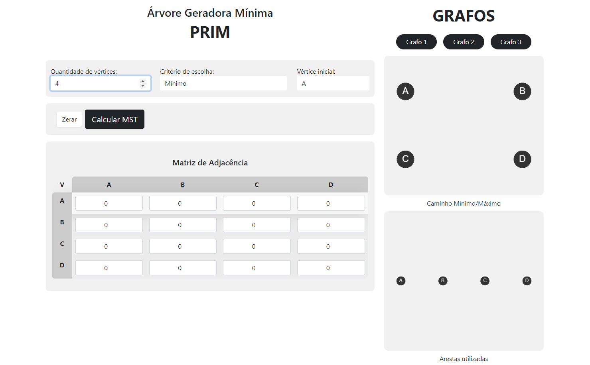
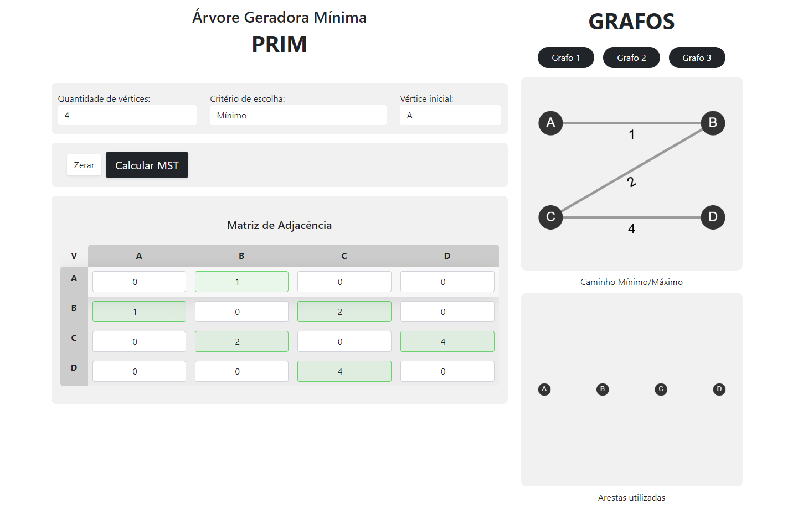
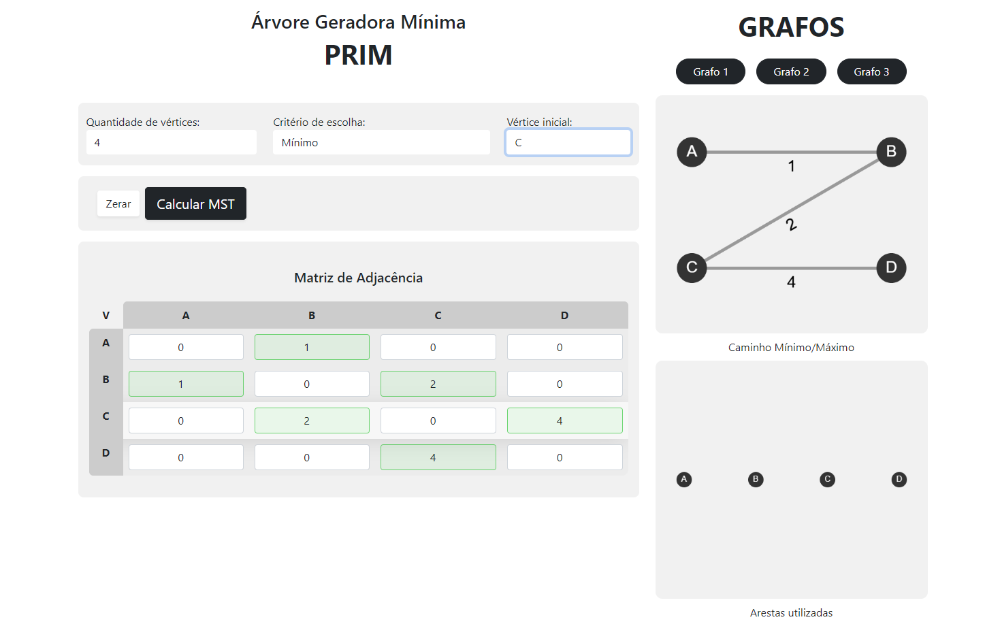
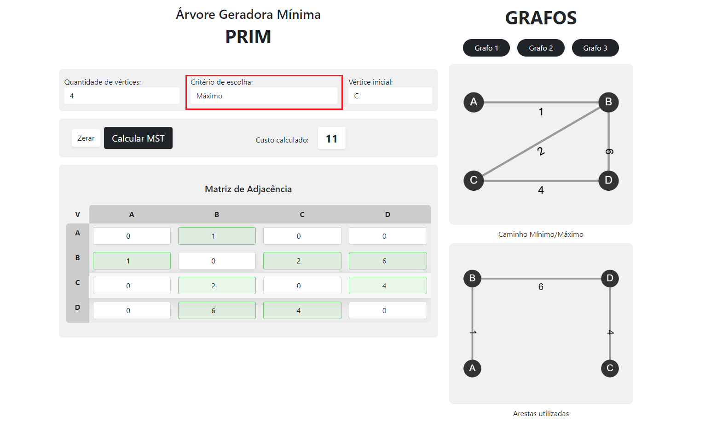
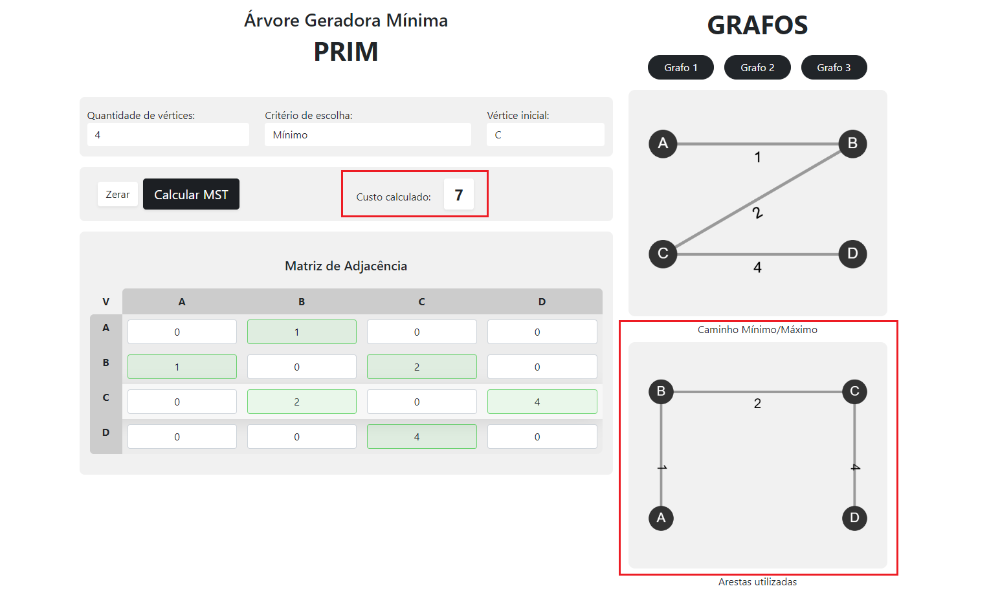

# Arvore Geradora Mínima
### Cálculo de arvore geradora mínima utilizando o algoritmo PRIM.
*_PRIM_*:  É um algoritmo guloso (greedy algorithm) empregado para encontrar uma árvore geradora mínima (minimal spanning tree) num grafo conectado, valorado e não direcionado.

#### Passo a passo para utilizar:
 
 #### 1. Tela inicial:

---

 2. Adicionando **vértices** 
    - Para cada vértice adicionada, será criado uma linha e coluna na Matriz de Adjacência.
    - Também serão adicionados os nós nos dois gráficos a direita para reproduzir o resultado posteriormente.
####  

---

3. Adicionando valor às ***arestas***:,
    - Por ser um grafo não direcionado, cada valor adicionado em uma vértice será "duplicado" para a outra vértice da aresta.
    - O grafo no canto superior direito representará a Matriz de Adjacência com os valores e arestas.
#### 

---

4. É possível trocar a ***vértice*** inicial para trocar a ordem de cálculo do algoritmo:
#### 

---

5. É possível também trocar o ***critério*** da árvore geradora, podendo ser ***mínimo*** ou ***máximo***:
#### 

---

6. Clicando no botão "Calcular MST" (_Minimum Spanning Tree_) é calculado o valor (mínimo ou máximo) do grafo:
   - O grafo com o caminho mínimo/máximo será representado no grafo do canto inferior direito.
#### 
